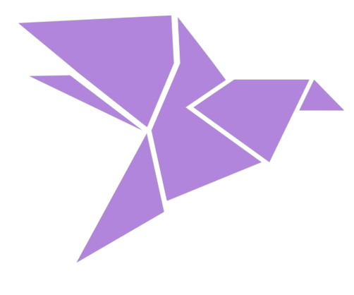

# Pomodorro

#### (Pomodorro-frontend)

  

## [Pomodorro]()

What is pomodoro timer app?  

Pomodorro is a customizable pomodoro timer app. The aim of this app is to help you focus on any task you are working on, such as study, writing, or coding. This app is inspired by Pomodoro Technique which is a time management method developed by Francesco Cirillo.

## Stack Used

- React
- SCSS
- Javascript

### Features

- Home page
- Authentication:
  - User Signup
  - User Login
  - Protected routes and redirection
- Task listing page - CRUD operations
  - create, update, read & delete tasks
- Pomodoro feature
  - start / pause the timer
  - reset the timer
  - Automatic witch to break and work mode
  - reset session after 2 cycles
  - alarm for modes
  - mongodb data persistence
- User can add multiple tag and priority for a atsk
- Page title in sync with Pomodoro time
- Loader and error states
- responsive

#### Backend for this project - [Pomodorro-backend](pomodorro-backend.vercel.app)

# Demo

  
